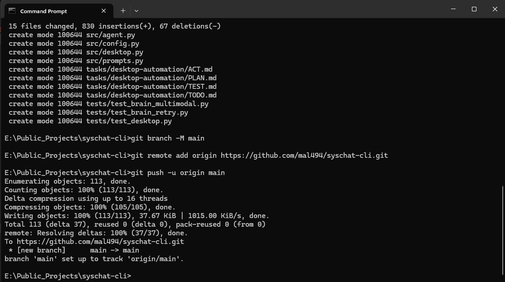

# SysChat 🖥️ 

**A Local RAG (Retrieval-Augmented Generation) CLI for System File Analysis.**

SysChat is a command-line utility that allows users to have natural language conversations about their file system. Unlike standard system tools (`ls`, `stat`, `cat`), SysChat combines file metadata extraction with a local LLM to provide context-aware answers about a file's purpose, history, and contents.

It features a **System-Safe Architecture** that prevents context overflow and safely handles binary files.

## 🚀 Features

* **Local RAG Implementation:** Dynamically injects file metadata and content into the LLM context window.
* **Dual-Mode "Brain":**
  * **Local Mode:** Runs entirely offline using **Ollama** (Llama 3, Mistral, DarkIdol).
  * **Cloud Mode:** Seamlessly switches to OpenAI/Gemini APIs if an API Key is detected.
* **Safety Guardrails:**
  * **Binary Protection:** Automatically detects and skips non-text files (images, binaries) to prevent encoding errors.
  * **Context Window Protection:** Implements a "Safe Reader" that caps reads at 10KB to prevent token limit crashes.
* **Universal Compatibility:** Works on Windows, Linux, and macOS.

## 🛠️ Architecture

SysChat operates in three distinct layers:

1. **The Harvester (`analyzer.py`):** Uses `pathlib` and `os` to extract low-level stats (permissions, timestamps, MIME types).
2. **The Safety Valve:** A middleware layer that checks file signatures and size before attempting a read operation.
3. **The Brain (`brain.py`):** A model-agnostic connector that formats the prompt into a structured conversation (System vs. User roles) and dispatches it to the active LLM.

## 📦 Installation

### Prerequisites

* Python 3.8+
* [Ollama](https://ollama.com/) (For local mode)

### Setup

1. **Clone the repository:**

    ```bash
    git clone [https://github.com/yourusername/syschat-cli.git](https://github.com/yourusername/syschat-cli.git)
    cd syschat-cli
    ```

2. **Create a Virtual Environment:**

    ```bash
    python -m venv .venv
    # Windows:
    .\.venv\Scripts\activate
    # Mac/Linux:
    source .venv/bin/activate
    ```

3. **Install Dependencies:**

    ```bash
    pip install -r requirements.txt
    ```

4. **Configure Model (Optional):**

    # Create a `.env` file to customize the model or use a cloud key.

    ```ini
    # .env
    LLM_MODEL=darkidol  # Defaults to 'llama3' if not set
    # LLM_API_KEY=sk-... # Uncomment to use OpenAI instead of Local
    ```

## 💻 Usage

Run the script pointing to any file on your system:

```bash
python src/main.py <path_to_file>