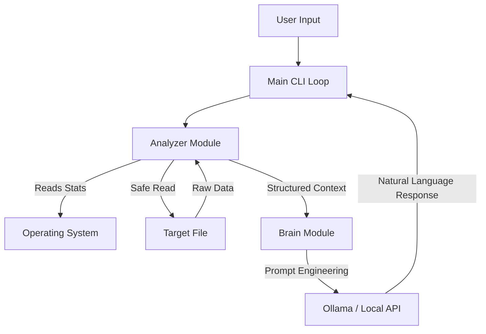

# Software Development Life Cycle (SDLC): SysChatProject: SysChat - Local RAG File Analysis Tool

Author: Michael Lind  
Version: 1.0.0  
Methodology: Agile / Iterative Development  

## 1. Phase 1: Planning & Requirement Analysis

**Objective:** To create a Command Line Interface (CLI) tool that allows users to query technical metadata and content of local files using Natural Language Processing (NLP).  

### 1.1 Problem Statement
Traditional system administration tools (ls, stat, cat) provide raw data but lack context. Junior developers and non-technical users struggle to interpret complex configuration files or logs without external assistance.  

### 1.2 Functional Requirements
- **Metadata Extraction:** System must retrieve file size, permissions, creation dates, and MIME types.  
- **Content Analysis:** System must safely read text-based files while ignoring binaries to prevent errors.  
- **Context Injection:** System must format file data into a structured prompt for the LLM.  
- **Chat Interface:** Users must be able to ask follow-up questions in a loop.  

### 1.3 Non-Functional Requirements
- **Privacy:** Data must process locally by default (Ollama) to ensure sensitive file data never leaves the machine.  
- **Resilience:** System must not crash when encountering unreadable or massive files.  
- **Portability:** Must run on standard Python 3.8+ environments (Windows/Linux/Mac).  

## 2. Phase 2: Feasibility & Tech Stack Selection

**Decision Matrix:**  

| Component     | Choice                      | Justification |
|---------------|-----------------------------|---------------|
| Language     | Python 3.10+               | Native OS interaction (pathlib), strong API support (requests), and ubiquity in AI dev. |
| LLM Backend  | Ollama (DarkIdol/Llama3)   | Zero-cost, runs offline, low latency. Chosen over OpenAI API to prioritize user privacy and cost. |
| Architecture | RAG (Retrieval-Augmented Generation) | We feed specific file data into the context window rather than fine-tuning a model. |
| Interface    | CLI (Command Line)         | Lowest barrier to entry for system tools; easy integration into existing developer workflows. |

**Risk Assessment:**  
- **Risk:** Large files exceeding LLM context window.  
- **Mitigation:** Implemented MAX_READ_SIZE (10KB) cap and "Metadata Only" fallback mode.  

## 3. Phase 3: System Design

### 3.1 High-Level Architecture
The system follows a modular "Pipeline" architecture to separate concerns (Data gathering vs. Intelligence).  

**Code snippet**  

### 3.2 Data Flow
- **Input:** User provides a file path argument.  
- **Processing:** analyzer.py verifies path existence and checks MIME type. If text/safe, content is loaded into memory (truncated if > 10KB). brain.py constructs a "System Prompt" defining the AI persona.  
- **Inference:** The structured prompt is sent via HTTP POST to localhost:11434.  
- **Output:** JSON response is parsed and displayed to stdout.  

## 4. Phase 4: Implementation (Development)

**Development Strategy:** Iterative "Vertical Slice."  
- **Iteration 1 (MVP):** Build the analyzer.py script to print file stats. No AI integration yet.  
- **Iteration 2 (Connection):** Build brain.py to send a "Hello World" to Ollama.  
- **Iteration 3 (Integration):** Combine modules. Feed stats into the AI prompt.  
- **Iteration 4 (Refinement):** Added "Safe Reader" logic to handle binary files and implemented Llama 3 specific prompt formatting (System/User tags) to fix hallucination issues.  

**Code Standards:**  
- **Modularity:** Logic split into src/ directory.  
- **Configuration:** Environment variables (.env) used for model selection and API keys.  
- **Error Handling:** Try/Except blocks around all I/O and Network operations.  

## 5. Phase 5: Testing Strategy

Testing was performed manually using a "Black Box" approach.  

### 5.1 Unit Testing Cases

| ID | Test Case     | Input                  | Expected Output              | Status   |
|----|---------------|------------------------|------------------------------|----------|
| T1 | Missing File  | python main.py ghost.txt | Error: "File not found"     | ✅ Pass |
| T2 | Binary File   | python main.py image.png | "Content Status: Skipped" (Metadata only) | ✅ Pass |
| T3 | Large File    | python main.py big_log.log | Read first 10KB only        | ✅ Pass |

### 5.2 System Integration Testing
- **Scenario:** User asks "When was this modified?"  
- **Pass Criteria:** AI mentions the specific date returned by the OS.  
- **Fail Criteria:** AI hallucinates a date or writes a blog post (Observed in v0.1, fixed in v1.0 by enforcing prompt templates).  

## 6. Phase 6: Deployment & Maintenance

### 6.1 Deployment
- **Distribution:** Source code via GitHub.  
- **Dependencies:** Managed via requirements.txt.  
- **Setup:** Requires User to install Python and Ollama independently.  

### 6.2 Future Roadmap (Maintenance)
- **v1.1:** Add "Directory Mode" to analyze entire folders.  
- **v1.2:** Add diff support to compare two files.  
- **v2.0:** Create a web-based UI using Streamlit.
